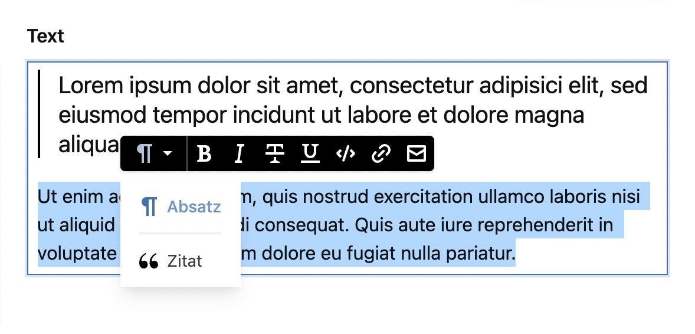

This functionality is now included in Kirby 4. Please upgrade to the first-party integration if you can.



# Custom Writer Field Nodes

This repository serves as a plugin boilerplate for extending the [writer field](https://getkirby.com/docs/reference/panel/fields/writer) with **custom nodes** until Kirby natively supports them.

This boilerplate is forked from Johann Schopplichs [Custom Writer field marks boilerplate](https://github.com/johannschopplich/kirby-writer-marks) and changes it to work with nodes.

## Installation

> ℹ️ Since this repo is a plugin template, I recommend you fork it and include it manually into your `site/plugins` folder.

### Download

Download and copy this repository to `/site/plugins/kirby-writer-nodes`.

### Git submodule

```
git submodule add https://github.com/coralic/kirby-writer-nodes.git site/plugins/kirby-writer-nodes
```

## Usage

This plugin adds a custom **quote mark**, which will create a `<blockquote>`-based element. Styling included.

You can create custom plugins yourself. To get inspiration, head over to Kirby's official [writer nodes](https://github.com/getkirby/kirby/tree/master/panel/src/components/Forms/Writer/Nodes). The Writer field is based on [ProseMirror](https://prosemirror.net/), so check out [their documentation to learn more about nodes](https://prosemirror.net/docs/ref/).

Custom nodes are located in [`src/Nodes`](./src/Nodes) and initiate inside [`src/index.js`](./src/index.js).

In order for custom nodes to show up, you need to add them manually to your plugin blueprints or extend the Writer Vue component to include them per default.

### Development

> ℹ️ [kirbyup](https://github.com/johannschopplich/kirbyup) is used for building the Kirby Panel plugin.

Spin up the development server to watch your main script. You will have to refresh the Panel manually to see your new custom nodes in the writer field.

```bash
npm run dev
```

### Production

Build the final Panel plugin:

```bash
npm run build
```

## Credits

- [Johann Schopplich](https://github.com/johannschopplich) for the Custom Writer field marks boilerplate this repo is based on
- [Roman Steiner](https://github.com/rasteiner) for his [Oh Hi Mark plugin](https://github.com/rasteiner/oh-hi-mark)

## License

[MIT License](./LICENSE) © 2021 [Tobias Möritz](https://github.com/tobimori)
